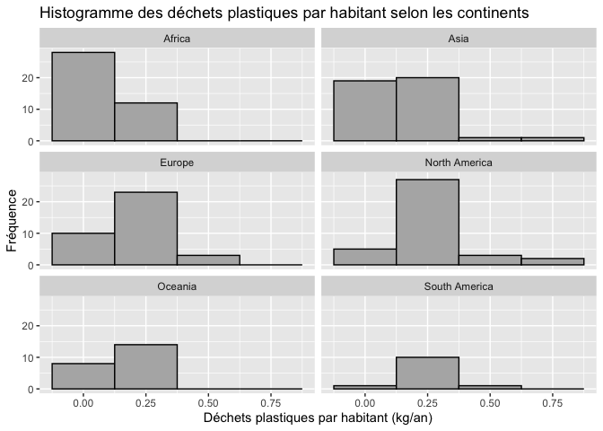
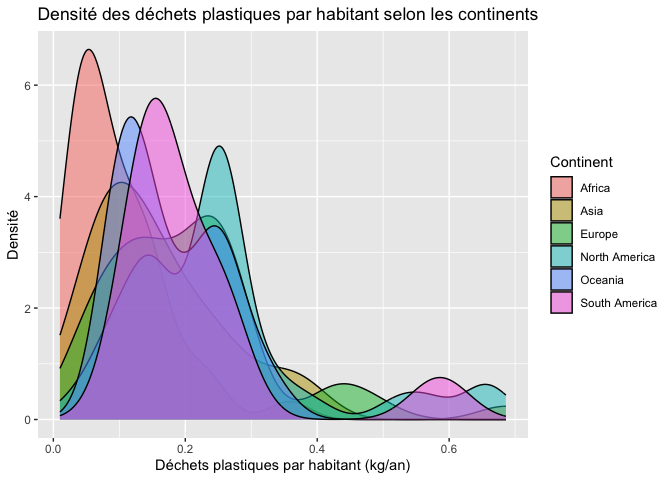
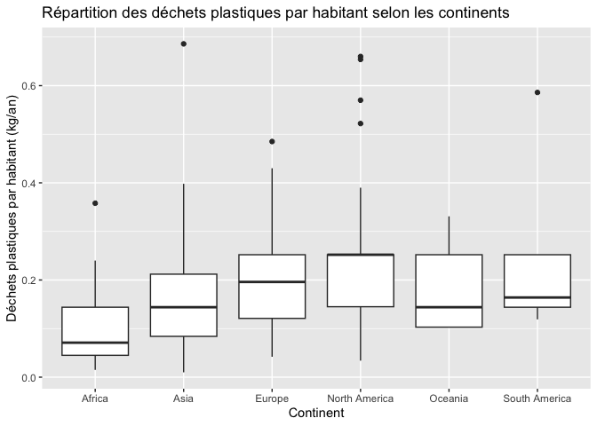
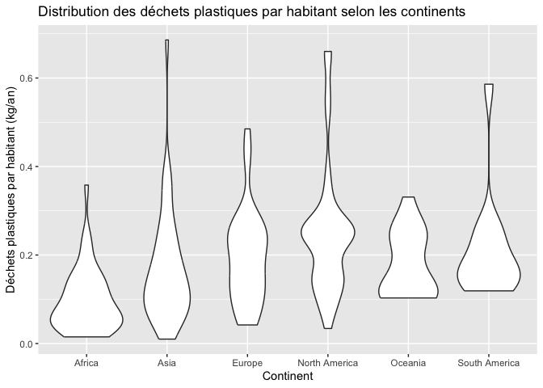
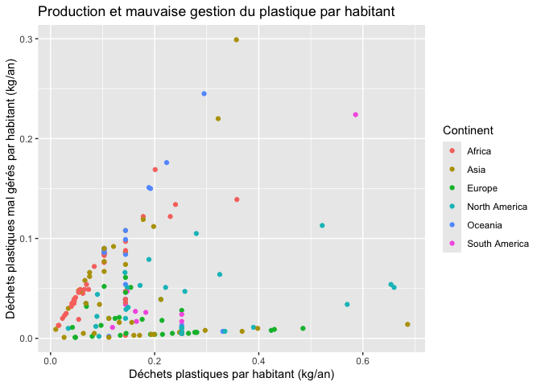
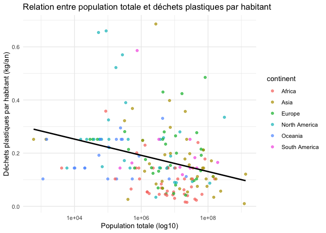
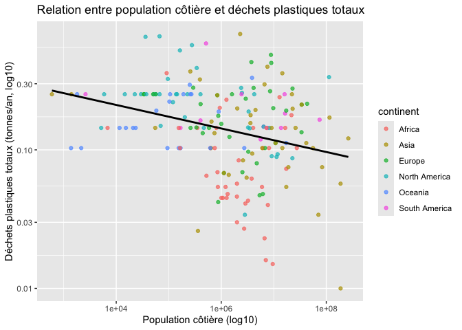
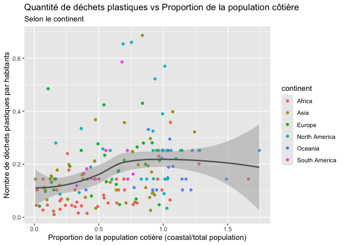

Lab 02 - Plastic waste
================
Mathis Azzopardi
18/09/2025

## Chargement des packages et des données

``` r
library(tidyverse) 
```

``` r
plastic_waste <- read_csv("data/plastic-waste.csv")
```

Commençons par filtrer les données pour retirer le point représenté par
Trinité et Tobago (TTO) qui est un outlier.

``` r
plastic_waste <- plastic_waste %>%
  filter(plastic_waste_per_cap < 3.5)
```

## Exercices

### Exercise 1

``` r
ggplot(plastic_waste, 
       aes(x = plastic_waste_per_cap)) +
  geom_histogram(binwidth = 0.25, color = "black", fill = "grey70") +
  facet_wrap(~ continent, ncol = 2) +
  labs(
    title = "Histogramme des déchets plastiques par habitant selon les continents",
    x = "Déchets plastiques par habitant (kg/an)",
    y = "Fréquence"
  )
```

<!-- -->

### Exercise 2

``` r
ggplot(plastic_waste, 
       aes(x = plastic_waste_per_cap, fill = continent)) +
  geom_density(adjust = 1, alpha = 0.5) +
  labs(
    title = "Densité des déchets plastiques par habitant selon les continents",
    x = "Déchets plastiques par habitant (kg/an)",
    y = "Densité",
    fill = "Continent"
  )
```

<!-- -->

Décrivez pourquoi le reglage de la couleur (`color` et `fill`) et le
réglage de la transparence (`alpha`) ne se trouvent pas au même endroit
? L’un étant réglé dans `aes` et l’autre dans `geom_density() :`

La couleur (*color*) est définie dans `aes()` car nous voulons
distinguer les continents par des couleurs différentes. En revanche,
dans `geom_density()`, nous plaçons l’argument `alpha` en dehors
de `aes()`, car nous souhaitons que toutes les courbes aient la même
transparence. Si nous l’avions mis dans `aes()`, la transparence aurait
varié en fonction du continent.

### Exercise 3

Boxplot:

``` r
ggplot(plastic_waste, 
       aes(x = continent, y = plastic_waste_per_cap)) +
  geom_boxplot() +
  labs(
    title = "Répartition des déchets plastiques par habitant selon les continents",
    x = "Continent",
    y = "Déchets plastiques par habitant (kg/an)"
  )
```

<!-- -->

Violin plot:

``` r
ggplot(plastic_waste, 
       aes(x = continent, y = plastic_waste_per_cap)) +
  geom_violin() +
  labs(
    title = "Distribution des déchets plastiques par habitant selon les continents",
    x = "Continent",
    y = "Déchets plastiques par habitant (kg/an)"
  )
```

<!-- -->

Qu’est ce que les violin plots permettent de voir sur les données que
les boxplot ne permettent pas ?

Les violin plots permettent de voir pour quelle proportion de dechets
par habitants chaques pays possede le plus par exemple l’afrique a en
majoritée une consommation de 0,05 Kg de dechets par jours

### Exercise 4

``` r
ggplot(plastic_waste,
       aes(x = plastic_waste_per_cap,
           y = mismanaged_plastic_waste_per_cap,
           color = continent)) +
  geom_point() +
  labs(
    title = "Production et mauvaise gestion du plastique par habitant",
    x = "Déchets plastiques par habitant (kg/an)",
    y = "Déchets plastiques mal gérés par habitant (kg/an)",
    color = "Continent"
  )
```

<!-- -->

Il semble que, de manière générale, plus la quantité de déchets par
habitant augmente, plus la quantité de déchets non gérés par habitant
augmente également. Cette tendance varie toutefois selon les continents
: elle apparaît plus marquée en Afrique et un peu moins prononcée en
Europe, par exemple.

### Exercise 5

``` r
ggplot(plastic_waste, aes(x = total_pop, 
                          y = plastic_waste_per_cap, 
                          color = continent)) +
  geom_point(alpha = 0.7) +
  scale_x_log10() +  # échelle log pour la population
   geom_smooth(method = "lm", se = FALSE, color = "black") +
  labs(x = "Population totale (log10)",
       y = "Déchets plastiques par habitant (kg/an)",
       title = "Relation entre population totale et déchets plastiques par habitant") +
  theme_minimal()
```

    ## `geom_smooth()` using formula = 'y ~ x'

    ## Warning: Removed 10 rows containing non-finite outside the scale range
    ## (`stat_smooth()`).

    ## Warning: Removed 10 rows containing missing values or values outside the scale range
    ## (`geom_point()`).

<!-- -->

``` r
ggplot(plastic_waste, aes(x = coastal_pop, 
                          y = plastic_waste_per_cap, 
                          color = continent)) +
  geom_point(alpha = 0.7) +
  scale_x_log10() +  
  scale_y_log10() +  
  geom_smooth(method = "lm", se = FALSE, color = "black") +
  labs(x = "Population côtière (log10)",
       y = "Déchets plastiques totaux (tonnes/an, log10)",
       title = "Relation entre population côtière et déchets plastiques totaux")
```

    ## `geom_smooth()` using formula = 'y ~ x'

<!-- -->

Il semble que la relation entre les déchets plastiques et la population
côtière soit plus forte. En effet, lorsqu’on considère la population
côtière, la production de déchets plastiques par habitant apparaît plus
marquée que sur une échelle globale, notamment parce que la population
est davantage concentrée le long des côtes.

## Conclusion

Recréez la visualisation:

``` r
plastic_waste_coastal <- plastic_waste %>% 
  mutate(coastal_pop_prop = coastal_pop / total_pop) %>%
  filter(plastic_waste_per_cap < 3)
ggplot(plastic_waste,
       aes(x = coastal_pop / total_pop,
           y = plastic_waste_per_cap,
           color = continent)) +
  geom_point() +
  geom_smooth(aes(color = NULL), se = TRUE, color = "grey40") +
  labs(title = "Quantité de déchets plastiques vs Proportion de la population côtière",
       subtitle = "Selon le continent",
       x = "Proportion de la population cotière (coastal/total population)", y = "Nombre de déchets plastiques par habitants")
```

    ## `geom_smooth()` using method = 'loess' and formula = 'y ~ x'

    ## Warning: Removed 10 rows containing non-finite outside the scale range
    ## (`stat_smooth()`).

    ## Warning: Removed 10 rows containing missing values or values outside the scale range
    ## (`geom_point()`).

<!-- -->
